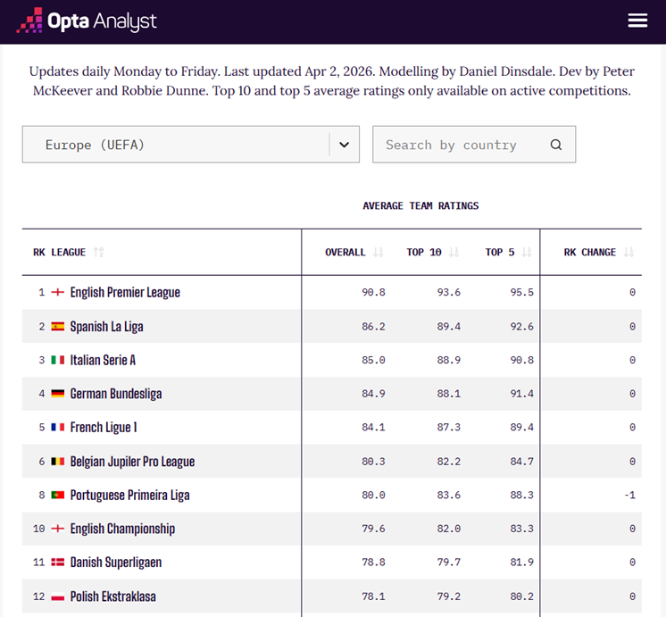
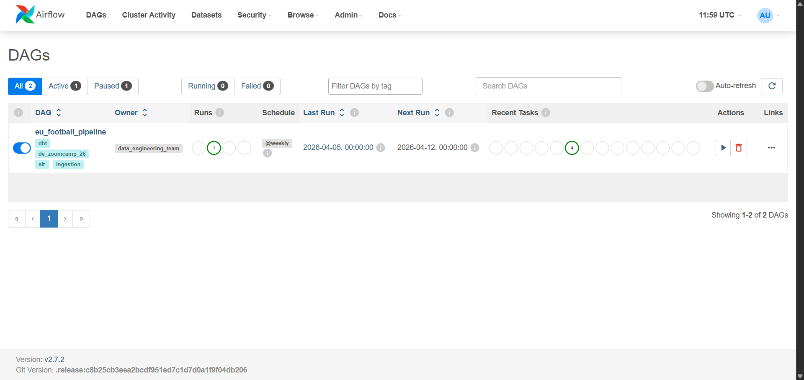
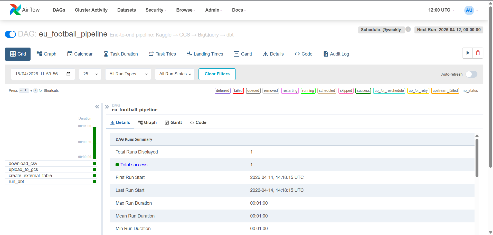
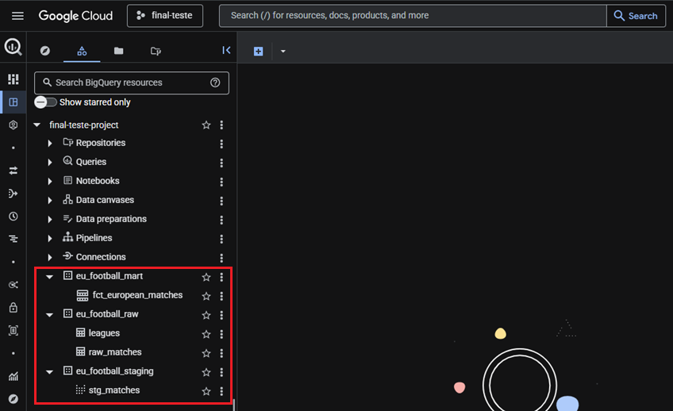
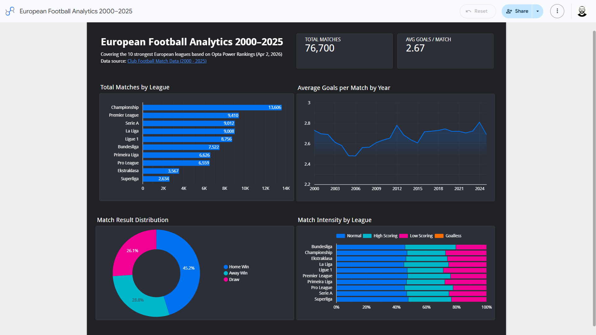

# European Football Analytics 2000–2025

An end-to-end **batch ELT data pipeline** built on Google Cloud Platform (GCP), using a single public Kaggle dataset to answer analytical questions about the top 10 European football leagues — from raw data to an interactive Looker Studio dashboard.

> 📊 **[View the Live Dashboard](https://lookerstudio.google.com/reporting/67b7d22f-b31f-40de-9af0-f8a87ab10c17)**

## 📌 Problem Description

The dataset contains football match data from more than 30 leagues worldwide, spanning from the 2000/01 season through the most recent results of the 2024/25 season.

This project focuses on the **top 10 European leagues**, selected based on the [Opta Power Rankings (Apr 2, 2026)](https://theanalyst.com/articles/strongest-football-leagues-in-the-world-opta-power-rankings), and addresses the following analytical questions:

- What is the total number of matches analyzed across all leagues and years?
- What is the overall average number of goals per match?
- Which leagues have the most matches played?
- How has the average number of goals per match evolved over time?
- How are match results distributed (Home Win / Away Win / Draw)?
- Which leagues produce the most high-scoring matches?

<p align="center">
  
</p>

## 🗺️ Architecture

```
[Kaggle API]
     │
     ▼  Python (Airflow DAG)
[Cloud Storage — GCS: raw/matches.csv]
     │
     ▼  BigQuery External Table (Airflow DAG)
[BigQuery — eu_football_raw]         ← Bronze
     │
     ▼  dbt (triggered via Airflow DAG)
[BigQuery — eu_football_staging]     ← Silver
     │
     ▼
[BigQuery — eu_football_mart]        ← Gold
     │
     ▼
[Looker Studio]
```

This project follows the **Medallion / ELT** pattern:
- **Bronze** — raw data landed in GCS and exposed via BigQuery external table
- **Silver** — staging layer: type casting, surrogate key generation, null filtering, join with league seed
- **Gold** — mart layer: filtered for 10 European leagues, enriched with calculated columns, partitioned by year, clustered by `division` and `league_name`

## 🏗️ Tech Stack

| Layer                         | Technology                        |
|-------------------------------|-----------------------------------|
| Cloud                         | Google Cloud Platform (GCP)       |
| Infrastructure as code (IaC)  | Terraform                         |
| Workflow orchestration        | Apache Airflow (Docker)           |
| Data Lake                     | Google Cloud Storage (GCS)        |
| Data Warehouse                | BigQuery                          |
| Transformations               | dbt Core                          |
| Dashboard                     | Looker Studio                     |

## 📦 Dataset

- **Source:** [Club Football Match Data 2000–2025 — Kaggle](https://www.kaggle.com/datasets/adamgbor/club-football-match-data-2000-2025)
- **Format:** Consolidated CSV dataset
- **Coverage:** 30+ leagues worldwide, seasons 2000/01 through 2024/25
- **Used in this analysis:** 10 European leagues (see below)

> **Note:** This project uses only the main CSV file from the dataset.

### Leagues Selected

| Code | Country  | League            |
|------|----------|-------------------|
| E0   | England  | Premier League    |
| SP1  | Spain    | La Liga           |
| I1   | Italy    | Serie A           |
| D1   | Germany  | Bundesliga        |
| F1   | France   | Ligue 1           |
| B1   | Belgium  | Pro League        |
| P1   | Portugal | Primeira Liga     |
| E1   | England  | Championship      |
| DEN  | Denmark  | Superliga         |
| POL  | Poland   | Ekstraklasa       |

## 📁 Repository Structure

```
european-football-analytics-2000-25/
├── terraform/               # GCP infrastructure (IaC)
├── dags/                    # Airflow DAG
├── dbt/                     # dbt project (models, seeds, tests)
├── .env.example             # Environment variable template
├── .gitignore
├── docker-compose.yaml
├── Dockerfile
├── README.md
├── requirements.txt
└── setup.sh                 # Initializes Airflow variables and GCP connection from .env
```

## 🚀 How to Reproduce

> ⚠️ The commands below were tested in a **WSL Ubuntu** environment. Any Linux terminal should work equivalently.

### Prerequisites

Before you begin, make sure you have the following installed and configured:

1. **Google Cloud project** with billing enabled
   → https://cloud.google.com/

2. **Google Cloud SDK** installed and authenticated
   → https://cloud.google.com/sdk/docs/install

3. **Terraform** installed
   → https://developer.hashicorp.com/terraform/install

4. **Docker** with Docker Compose installed
   → https://docs.docker.com/engine/install/

5. **Kaggle account** with API credentials generated
   → https://www.kaggle.com/


### Step 1 — Clone the Repository & Configure Environment Variables

```bash
git clone https://github.com/orafarotter/european-football-analytics-2000-25.git
cd european-football-analytics-2000-25
```

Copy the environment variable template and fill in your values:

```bash
mv .env.example .env
```

Edit `.env` with your values:

| Variable | Description | How to get it |
|---|---|---|
| `AIRFLOW_SECRET_KEY` | Secret key for Airflow webserver sessions | Run: `python -c "import secrets; print(secrets.token_hex(32))"` |
| `AIRFLOW__CORE__FERNET_KEY` | Encryption key for sensitive data (connections, variables) | Run: `python -c "from cryptography.fernet import Fernet; print(Fernet.generate_key().decode())"` |
| `GCP_PROJECT_ID` | Your GCP Project ID | GCP Console → Project selector |
| `GCP_REGION` | GCP region (e.g. `us-east1`) used for resources | Your preferred region |
| `GCS_BUCKET` | Name for the GCS bucket | Choose a globally unique name |
| `KAGGLE_USERNAME` | Your Kaggle username | kaggle.com → Settings → Active logins |
| `KAGGLE_KEY` | Your Kaggle API key | kaggle.com → Settings → API Tokens → Generate New Token |


### Step 2 — Configure Terraform Variables

```bash
cd terraform
mv terraform.tfvars.example terraform.tfvars
```

Edit `terraform.tfvars` with your values:

```hcl
project_id           = "<GCP_PROJECT_ID>"
region               = "<REGION>"
bucket_name          = "<BUCKET_NAME>"
service_account_name = "<SERVICE_ACCOUNT_NAME>"
```

> ⚠️ `project_id`, `region`, and `bucket_name` must match the values set in `.env`.
> The `service_account_name` must match the regex: `^[a-z]([-a-z0-9]*[a-z0-9])?$`


### Step 3 — Authenticate with GCP & Provision Infrastructure

Authenticate with your Google account:

```bash
gcloud auth login
```

If you have multiple projects, confirm you are using the correct one:

```bash
gcloud config get-value project
# If incorrect:
gcloud config set project <GCP_PROJECT_ID>
```

Then provision the infrastructure with Terraform (still inside the `terraform/` folder):

```bash
terraform init
terraform plan
terraform apply
```

Wait for the provisioning to complete. This will create:
- A dedicated GCP service account with least-privilege access
- A GCS bucket for the raw data lake
- BigQuery datasets: `eu_football_raw`, `eu_football_staging`, `eu_football_mart`


### Step 4 — Start Airflow and Run the Pipeline

Return to the project root:

```bash
cd ..
```

Build the Docker image and initialize Airflow:

```bash
docker compose build             # Build the custom image (uses cache on subsequent runs)
docker compose up airflow-init   # Run DB migrations and creates the admin user
docker compose up -d             # Start all containers in detached mode
bash setup.sh                    # Run initial Airflow setup
```

Access the Airflow UI at **http://localhost:8080**

```
Username: admin
Password: admin
```

The DAG will appear on the home screen. Enable it using the **toggle switch**, then open it to monitor execution.

<p align="center">
  
</p>

#### What the pipeline does

The DAG runs the following tasks in sequence:

1. **`download_csv`** — Downloads the dataset from Kaggle using your API credentials, extracts it to `/tmp/football/`, and removes any files other than `Matches.csv`.
2. **`upload_to_gcs`** — Uploads `Matches.csv` to the GCS bucket under `raw/Matches.csv`. If the file already exists, it is overwritten (idempotent).
3. **`create_external_table`** — Drops and recreates a BigQuery external table in `eu_football_raw` pointing to the GCS file, with an explicit schema (no auto-detect).
4. **`run_dbt`** — Runs the full dbt project:
   - Seeds the `leagues` reference table
   - Builds `stg_matches` (view): type casting with `SAFE_CAST`, surrogate key generation, null filtering on `MatchDate`, `HomeTeam` and `AwayTeam`, and a join with the `leagues` seed to enrich records with `country`, `league_name` and `match_year`
   - Builds `fct_european_matches` (table): filtered for the 10 European leagues, partitioned by year, clustered by `division` and `league_name`, with enriched columns (`total_goals`, `goal_difference`, `match_result_label`, `goal_timing`, `scoring_category`)
   - Runs all dbt tests

<p align="center">
  
</p>

Once the DAG completes successfully, verify the output in **BigQuery** → `eu_football_mart` → `fct_european_matches`.

<p align="center">
  
</p>

### Step 5 — Explore the Dashboard

The dashboard built for this project is available [here](https://lookerstudio.google.com/reporting/67b7d22f-b31f-40de-9af0-f8a87ab10c17).

To build your own dashboard connected to your data:

1. Go to [https://lookerstudio.google.com](https://lookerstudio.google.com)
2. Click **+ Create** → **Report**
3. Connect to **BigQuery**:
   - In *"Add data to report"* → **Connect to data**, select or search for **BigQuery**
   - Choose:
     - Project: your GCP project
     - Dataset: `eu_football_mart`
     - Table: `fct_european_matches`
4. If prompted with *"You are about to add data to this Report"*, click **Add to Report**

You are now ready to build your own visualizations.


### Teardown

To stop and remove all containers:

```bash
docker compose down
```

To destroy all GCP infrastructure provisioned by Terraform:

```bash
cd terraform
terraform destroy
```

## 📊 Dashboard Preview



> **[Open Dashboard](https://lookerstudio.google.com/reporting/67b7d22f-b31f-40de-9af0-f8a87ab10c17)**

**Tiles:**
- 🔢 KPI Scorecards — Total Matches · Average Goals per Match
- 📈 Line Chart — Average Goals per Match by Year (2000–2025)
- 📊 Bar Chart — Total Matches by League
- 🍩 Donut Chart — Match Result Distribution (Home Win / Away Win / Draw)
- 📊 Stacked Bar Chart — Match Intensity by League (`scoring_category`)

---

## ⭐ Going the Extra Mile

- **dbt tests** — tests across the models covering `not_null`, `accepted_values`, and `relationships` constraints. All tests pass ✅

---

## 🔐 Security Notes

- Never commit credentials or service account keys to the repository
- `.gitignore` excludes `*.json`, `*.tfvars`, and `.env`
- Use `terraform.tfvars.example` and `.env.example` as safe templates for collaborators
- Airflow credentials are injected via Variables (no hardcoding in DAG files)